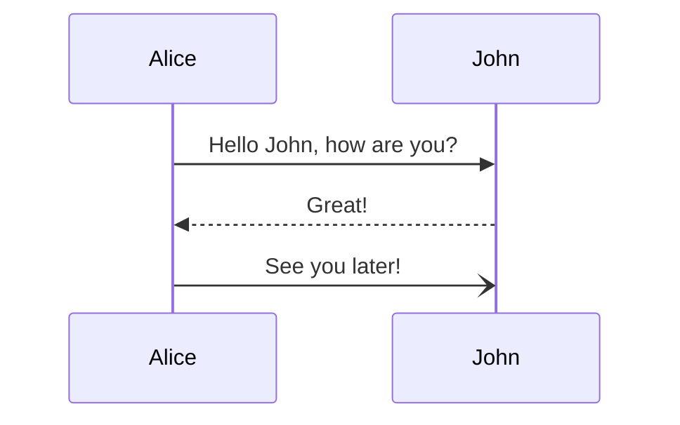

# Sequence diagrams

> A Sequence diagram is an interaction diagram that shows how processes operate with one another and in what order.

Mermaid can render sequence diagrams.

```mermaid-example
sequenceDiagram
    Alice->>John: Hello John, how are you?
    John-->>Alice: Great!
    Alice-)John: See you later!
```
