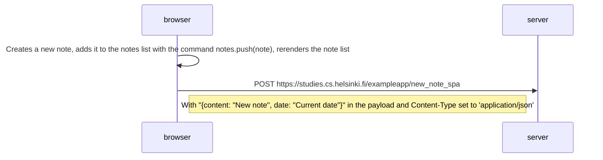

```mermaid
sequenceDiagram
    participant browser
    participant server

    browser->>browser : Creates a new note, adds it to the notes list with the command notes.push(note), rerenders the note list

    browser->>server: POST https://studies.cs.helsinki.fi/exampleapp/new_note_spa
    Note right of browser: With "{content: "New note", date: "Current date"}" in the payload and Content-Type set to 'application/json'
```
